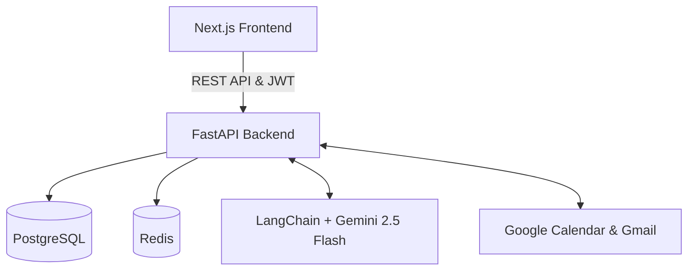

# Aheadly - Plan Smarter. Finish Earlier.

Aheadly is an **AI-powered productivity companion** built for the VIBE2SHIP Hackathon. It proactively helps users complete work before deadlines instead of simply reminding them. Moving beyond traditional to-do lists, Aheadly acts as an autonomous agent that understands your tasks, prioritizes them intelligently, and schedules them into your life.

## ✨ Key Features (Hackathon Highlights)

- 🧠 **Smart Extract (NLP)**: Paste raw text (emails, syllabus, random notes), and our Gemini AI automatically extracts the task, deadline, and urgency score to build your to-do list instantly.
- 🎙️ **Voice-Enabled AI Chat**: Speak naturally to the Aheadly Assistant using the built-in animated voice visualizer. Ask it to "find time for my physics assignment" and it understands context.
- 📅 **Google Calendar Integration**: Secure OAuth 2.0 sync. The AI reads your free time blocks and automatically schedules tasks when you actually have time to do them.
- 🔥 **Gamified Productivity**: Track your "Productivity Score" and daily "Streak Days" to build lasting habits.
- 🎨 **Premium UI/UX**: Designed with dark-mode glassmorphism, fluid micro-animations (Framer Motion), and a dynamic frequency visualizer for voice interactions.

## 🛠 Tech Stack
- **Frontend**: Next.js 15 (App Router), TypeScript, TailwindCSS, Framer Motion, lucide-react
- **Backend**: FastAPI, PostgreSQL, SQLAlchemy, OAuthlib
- **AI**: Google Gemini 2.5 Flash API
- **Deployment**: Local dev (Uvicorn + Next dev server)

## Architecture



## Folder Structure

The project uses a standard monorepo structure:
- `apps/web/`: Next.js frontend application.
- `apps/api/`: FastAPI backend application.
- `packages/shared/`: Shared TypeScript types and configurations.
- `docker-compose.yml`: Root orchestrator.

## Installation Guide

### Prerequisites
- Node.js (v18+)
- Python 3.11+
- Docker & Docker Compose
- Google Gemini API Key
- Google OAuth Client ID & Secret

### Environment Variables
Create `.env` based on `.env.example`:
```env
GEMINI_API_KEY=your_key
POSTGRES_USER=postgres
POSTGRES_PASSWORD=postgres
POSTGRES_DB=aheadly
REDIS_URL=redis://redis:6379/0
SECRET_KEY=dev_secret_key
```

### Local Development

**1. Using Docker (Recommended)**
```bash
docker compose up -d --build
```
- Frontend runs on `http://localhost:3000`
- API runs on `http://localhost:8000/docs`

**2. Manual Setup**
*Frontend:*
```bash
cd apps/web
npm install
npm run dev
```

*Backend:*
```bash
cd apps/api
python -m venv venv
source venv/bin/activate
pip install -r requirements.txt
alembic upgrade head
uvicorn app.main:app --reload
```

## Deployment Steps
1. Push the repository to GitHub.
2. Build the Docker images for `apps/web` and `apps/api`.
3. Deploy the images to Google Cloud Run.
4. Set up a managed Cloud SQL instance for PostgreSQL and Memorystore for Redis.
5. Provide the environment variables in the Cloud Run configuration.
